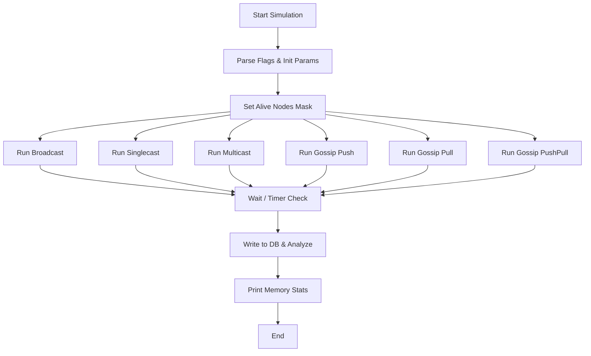
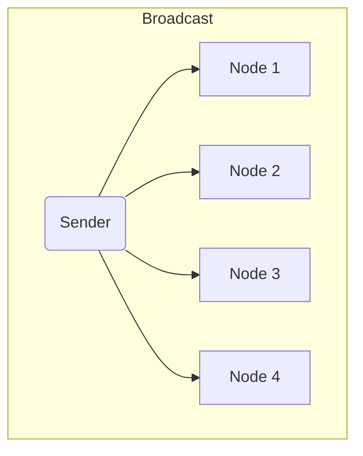
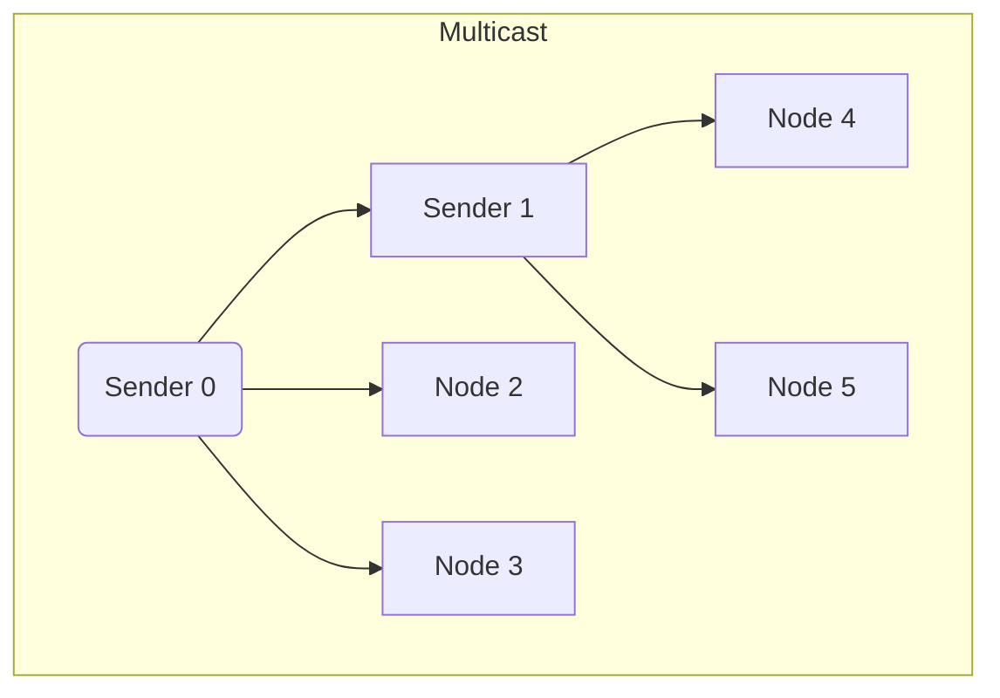
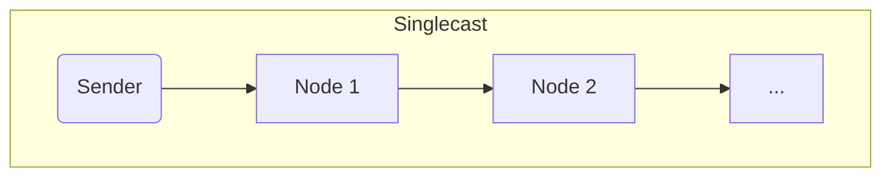
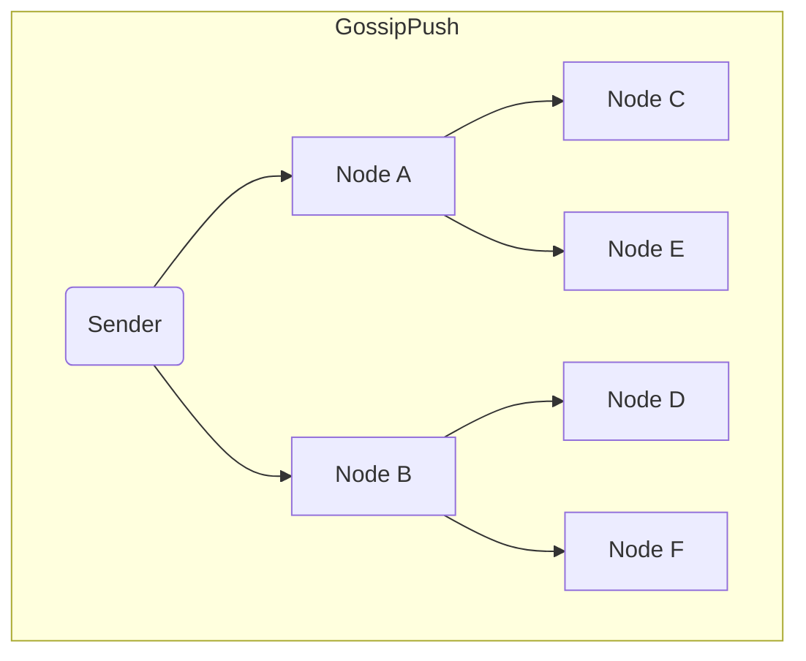
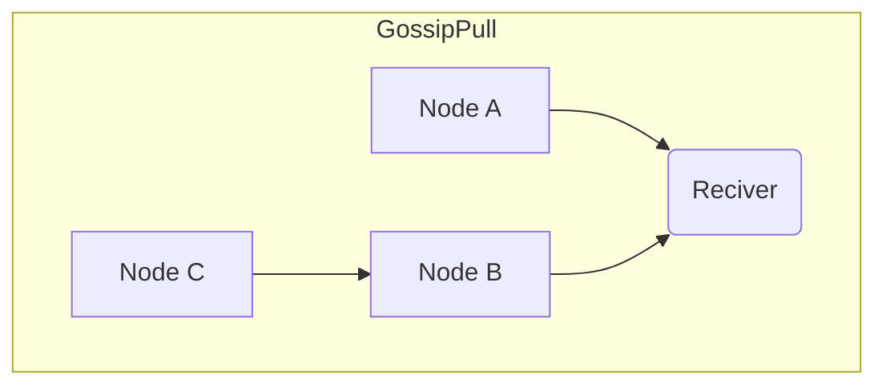
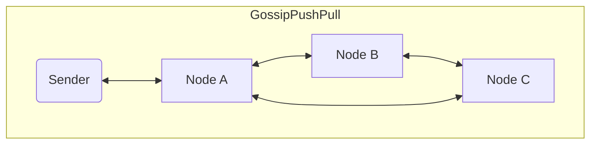

# Distributed Systems Simulation

This project simulates information dissemination in distributed systems using different communication protocols: **singlecast**, **multicast**, **broadcast**, and **gossip** (with variants like push, pull, and push-pull).  

It models real-world conditions such as **packet loss**, **node failures**, and **network delays**, and collects performance metrics like **time to full propagation** and **coverage percentage** over time.

## Features

- Simulation of 100+ nodes as lightweight goroutines.
- Simulates network delays, message loss, and message corruption
- Supports configurable node counts, domains, fan-out, and more
- Automatically collects metrics and writes to a database
- Outputs CSV logs per node
- Memory usage statistics included
- Full analysis pipeline per simulation type

## Technologies

- **Golang** for simulation engine.
- **Channels** and **goroutines** for concurrency.
- **CSV logging** for easy post-processing and visualization.

## Usage

Run the simulation with custom flags:

```bash
go run main.go \
  -id 1 \
  -nodes 100 \
  -domains 3 \
  -fanout 2 \
  -delay 20 \
  -alive 0.9 \
  -loss 0.05 \
  -corrupt 0.05 \
  -timer 30
```

## Flags

Flag Description
-**id** Experiment ID
-**timer** Max time (sec) allowed for each simulation
-**nodes** Number of nodes in the network
-**domains** Multicast domain count
-**fanout** Gossip fan-out (neighbors per round)
-**delay** Mean delay in message delivery (ms)
-**alive** Probability a node is operational
-**loss** Probability of message loss
-**corrupt** Probability of message corruption
-**remove-db** Delete previous experiment data from DB
-**verbose** Show detailed logs

## Simulations

Each simulation is prepared with:

- Node initialization
- Alive-state randomization
- CSV log creation per node

Then one of the following is run:

- Broadcast — One-to-all send
- Singlecast — One-to-one targeted send
- Multicast — Domain-based multiple group sends
- Gossip Push/Pull/PushPull — Epidemic-style message spread

[Report](/report/report.md)

## Output

- CSV logs per node saved to /metrics
- Aggregated metrics saved to SQLite DB
- Output logs saved per experiment run



---

## Algorithms












