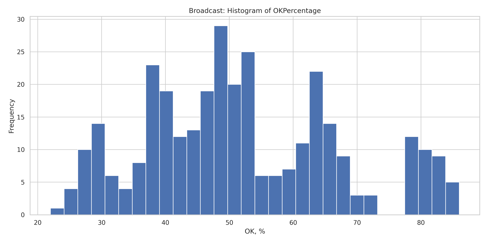
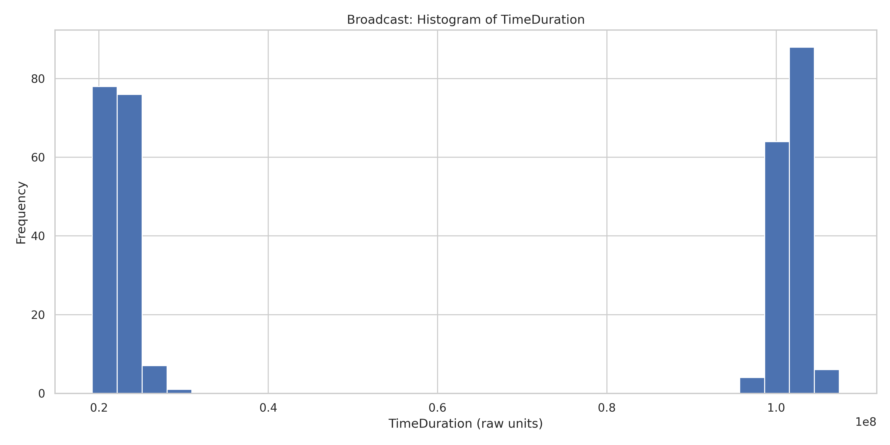

# 📄 Simulation Report: Message Dissemination Algorithms

## 📁 Dataset

**File:**
`experiment/merics_db_AnalyzeResults.csv`
Contains performance metrics from simulated runs of various message dissemination algorithms.

- NODES: 100 200 300 400 500 600;
- FANOUT: 1 2 3;
- DELAY:10 50;
- ALIVE: 0.6 0.8 1.0;
- LOSS and CORRUPT: 0.1 0.2 0.3.

---

## ⚙️ Algorithms Evaluated

- **Broadcast**
- **Multicast**
- **Singlecast**
- **GossipPush**
- **GossipPull**
- **GossipPushPull**

---

## 📊 Summary Metrics (per Algorithm)

| Metric              | Description                                    |
| ------------------- | ---------------------------------------------- |
| `OKPercentage`      | Percentage of successfully delivered messages  |
| `TimeDuration`      | Time taken by the algorithm                    |
| `TotalMessages`     | Total number of messages exchanged             |
| `Efficiency`        | `OKCount / TotalMessages` – message usefulness |
| `MaxSentFromNode`   | Max messages sent by a single node             |
| `MaxReceivedByNode` | Max messages received by a single node         |

---

## Summary table

|   |      Algorithm | Mean_TimeDuration | Mean_Rounds | Mean_TotalMessages | Mean_OKPercentage | Mean_CorruptedPercentage | Mean_LostPercentage |
|--:|---------------:|------------------:|------------:|-------------------:|------------------:|-------------------------:|--------------------:|
| 0 | Broadcast      | 6.214109e+07      | 1.00        | 349.00             | 51.87             | 12.31                    | 35.81               |
| 1 | GossipPull     | 1.061553e+11      | 15.23       | 5963.76            | 36.45             | 43.53                    | 20.01               |
| 2 | GossipPush     | 1.653567e+11      | 15.39       | 2733.64            | 35.85             | 40.28                    | 23.87               |
| 3 | GossipPushPull | 2.623824e+10      | 9.56        | 10105.63           | 39.86             | 38.38                    | 21.77               |
| 4 | Multicast      | 5.226528e+09      | 3.00        | 349.00             | 34.87             | 15.29                    | 49.84               |
| 5 | Singlecast     | 5.308545e+07      | 1.00        | 2.41               | 0.85              | 0.20                     | 98.95               |

## 📈 Key Diagrams

### ✅ 1. OKPercentage vs NodeCount

- Shows reliability as the network size increases.
- **Broadcast** remains highly reliable regardless of size.
- **Gossip** algorithms tend to degrade as node count grows.

### ✅ 2. TimeDuration vs NodeCount

- Performance scaling with network size.
- **GossipPush** is the slowest.
- **Broadcast** and **Multicast** are fast and scalable.

### ✅ 3. TotalMessages vs NodeCount

- Shows network traffic load.
- **GossipPush** creates the most traffic.
- **Broadcast** is extremely efficient.

### ✅ 4. Total Messages per Algorithm

This bar chart illustrates the **average number of messages** sent across the network for each algorithm.

- **GossipPush** and **GossipPushPull** generate the highest volume of messages due to repeated propagation and redundancy.
- **Broadcast** is the most message-efficient, requiring significantly fewer transmissions.
- **Multicast** sits in between, offering a reasonable balance.

### ✅ 5. Time Duration per Algorithm

This chart shows the **average execution time** (simulation duration) of each algorithm.

- **GossipPush** incurs the highest time cost due to its extensive message dissemination.
- **Broadcast** and **Singlecast** complete the fastest, making them preferable when low latency is critical.
- **Multicast** offers moderate timing with moderate reliability.

### ✅ 6. Boxplot of Efficiency

- Displays consistency and spread of algorithm performance.
- **Broadcast** shows high median and low variance.
- **Gossip** strategies vary greatly.

### ✅ 7. Max Sent messages per node

- Indicates how many messages are delivered from one node.
- **GossipPull** and **GossipPush** exhibit the highest per-node sending load.
- **Broadcast** and **Multicast** distribute sending more evenly across nodes.

---

## Broadcast

## Gossip Pull

## Gossip Push

## Gossip Push Pull

## Multicast

## Singlecast

## OKPercentage Distribution

## OKPercentage (Bar & Conditional Analysis)

### 🔄 DelayMean and LossProbability

- Higher `DelayMean` reduces OKPercentage for all algorithms.
- When `LossProbability > 0`, most algorithms drop sharply in performance — except for **Broadcast**.

